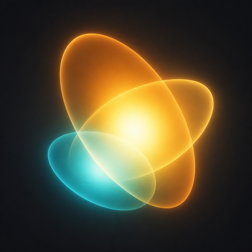

<p align="center">
  
</p>

# Simple 3DGS

**Video in, Gaussian splat out.**

A small macOS app. You walk around something with your phone, drop the clip, and get a 3D Gaussian splat you can fly through. No Python. No CUDA. No Homebrew on the machine that runs it.

```
Video → FFmpeg frames → COLMAP poses → Brush training → Spark viewer
```

FFmpeg, COLMAP, and Brush live inside the `.app`. The UI is dark charcoal and amber — same as the mark: a handful of glowing ellipsoids, which is all a splat really is.

Intentionally not in scope: 4D, 360, upscaling, mesh export, a cloud. One camera, one focal length, one Mac.

## Capture

Bad splats are almost always bad capture, not the trainer. Shoot for COLMAP first.

1. Pick **Object** (slow orbit), **Room** (along the walls), or **Outdoor** (along a path).
2. Drop a video or a folder of stills. No zoom, fixed exposure, little motion blur.
3. Start with **Fast**. **Quality** can take hours; use it when Fast already found a plausible scene.
4. **Reconstruct.** Then fly it. Finished scenes land in an archive, on a map if the clip has GPS.

If cameras do not recover, reshoot: slower, more overlap, less blur. Rooms need textured walls. Outdoors, tilt down off empty sky.

## Requirements

- macOS 14+ on Apple Silicon
- 16 GB unified memory minimum (24 GB+ is more comfortable)
- For **building**: Node 22+, Rust 1.88+, Xcode CLT
- For **bundling sidecars**: Homebrew (COLMAP deps), Rust (Brush + `tools/colmap-bundle`), network (FFmpeg source, colmap-metal)
- For **COLMAP Metal SIFT**: full **Xcode** (App Store), then `xcodebuild -runFirstLaunch` and `xcodebuild -downloadComponent MetalToolchain`. Command Line Tools are not enough — `xcrun metal` is a separate component in Xcode 26+.

## Develop

```sh
./scripts/fetch-sidecars.sh          # PATH stubs so Tauri can start
npm install
npm run test:rust
npm run tauri dev
```

Stubs forward to `ffmpeg`, `colmap`, and `brush`/`brush-cli` on your PATH.
Named presets use CPU SIFT (VLFeat). Expert/Custom can switch Reconstruction → SIFT to **Metal** (GPU, less RAM) when the sidecar is the Metal fork.
To ship a self-contained app:

```sh
./scripts/fetch-sidecars.sh --all
npm run tauri build
```

`--all` compiles an **LGPL** FFmpeg with VideoToolbox (no `--enable-gpl`),
builds COLMAP from [colmap-metal](https://github.com/byplay-io/colmap-metal) (Metal SIFT, no Qt GUI),
and builds Brush `brush-cli` from `main`. Metal SIFT matches on the GPU; CPU SIFT matching skips FAISS (`--SiftMatching.cpu_brute_force_matcher 1`). `./scripts/fetch-sidecars.sh --bundle` still copies
Homebrew COLMAP for a faster CPU-only sidecar. The resulting sidecars stay
gitignored under `src-tauri/binaries/`.

## License

Apache-2.0 for the app. Bundled tools are separate executables; see
[THIRD_PARTY_NOTICES.md](THIRD_PARTY_NOTICES.md) and [NOTICE](NOTICE).

GPL-3.0 and AGPL-3.0 sidecars are allowed when they form a compatible
set with the rest of the bundle (GPL-3 / AGPL-3 / LGPL / permissive).
GPLv2 is not: it conflicts with Apache-2.0.

The FFmpeg sidecar is LGPL and replaceable: swap `ffmpeg` next to the
app binary with another LGPL build.

Not included: Inria Gaussian Splatting (research license, not OSI),
Nerfstudio / gsplat (CUDA / Python, not a Mac sidecar).
